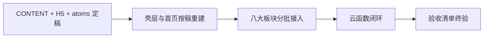

# 嘻嘻启蒙乐园 · 设计与开发规划（终审定稿）

> 唯一需求源：
>
> - `[小程序需求优化版.md](../小程序需求优化版.md)`
> - `[小程序开发核对清单.md](../小程序开发核对清单.md)`
> - 内容与视觉定稿：[CONTENT.md](./CONTENT.md) + `docs/design/h5/` + `docs/design/atoms/`
>
> 复核：2026-09-04 已按 `miniprogram/` 现行实现同步（`.detail-card` / `--opacity-disabled: 0.86` / `.custom-header__home` / `--shadow-lift` / 算术两题型无固定题量）

---

## 0. 当前状态

| 项          | 状态                |
| ---------- | ----------------- |
| 需求文档       | 已定稿（`docs/` 下需求与验收清单 + 本规划） |
| 内容题库       | **已定稿**：见 [CONTENT.md](./CONTENT.md) 与 `docs/design/content/*.json` |
| 设计稿 / 原子素材 | **H5 审查稿 + atoms 已确认可作视觉基准**（`docs/design/h5/`、`docs/design/atoms/`） |
| 业务页代码      | **八大板块已接入**；样式与 H5 双向同步（见仓库 `.cursor/rules/h5-miniapp-style-sync.mdc`） |
| 每日任务       | **已实现**：自由学习按数量累计；数量每天随机（古诗 1～2，字/题/英语 1～5，拼音 1～6，日历固定 1「日历打卡」）；英语任务名「学 N 个英语」，字母名与单词计入同一条；实现 `miniprogram/utils/daily-tasks.js`（`SCHEMA = 10`） |
| 反馈闭环       | **已实现**：任务/兑换弹层 `feedback-layer`；算术 feedback-bar + 成败音效；禁 Toast（见 CONTENT §2.8） |
| 家长区         | **已实现**：欢迎卡进入；音量三档；长按 3 秒重置/清除每日任务 / 学习记录 / 星星 / 贴纸（每日任务走 `dailyTasks` reset，其余走 `resetProfile`） |
| 点读音频       | 分包 MP3 + `utils/audio.js` + `read-award.js`；音色/语速见 [CONTENT §2.10](./CONTENT.md)；拼音喂注音「ㄚㄛㄜㄧㄨㄩ」；字母 Z=`zee`；文件名 ASCII slug；真机需 `setInnerAudioOption`；失败落「语音准备中～」 |
| 设计 token     | `docs/design/h5/css/tokens.css` ↔ `miniprogram/styles/tokens.wxss`；字号下限 28（`--font-nav`）；禁用态 opacity 0.86（`--opacity-disabled`）；答题选中 `--tone-picked` |
| 云端存储（图片） | 环境已配置；默认 `USE_CLOUD = false`（免费套餐 ACL）；手动/自动化见 [`../../cloud-assets/README.md`](../../cloud-assets/README.md) |
| 云函数         | **已部署并对齐本地**：`login` / `getProfile` / `getProgress` / `addStars`（含 `letter_done`）/ `checkinTask` / `dailyTasks` / `completeProgress` / `bumpHeat` / `exchangeReward` / `resetProfile` / `initDb`。启动同步积分/进度；云为主存，加星/进度失败时本地队列兜底并冲刷 |

---

## 1. 产品锁定

- **名称（产品内部 / 页内展示）**：嘻嘻启蒙乐园
- **名称（微信后台创建 / 搜索展示）**：嘻宝星屋（过审用对外名；申请文案见 `docs/apply/miniprogram-intro.md`）
- **人群**：幼儿园宝宝
- **形态**：微信原生小程序，移动端优先，`750rpx` 设计/实现基准
- **气质**：晨间草地柔光 + 圆角积木控件 + 全站黏土软萌素材/动物
- **原则**：护眼低饱和、极简操作、低难度、全正向激励、零负面反馈、无广告/付费/营销弹窗、云端永久存储（任务与兑换反馈弹层 `feedback-layer` 允许，禁 Toast）

---

## 2. 全局 UI / 壳层硬约束

### 2.1 视觉

- 背景：全站晨间浅绿柔光草地（淡嫩绿 + 柔光白）；仅静态浅云/光斑/草纹理，无闪烁动效
- **面控件气质：鹅卵石黏土（cobble / clay）** — 主卡、选项、伙伴坞、气泡、石子径、星条等「面」级容器统一此风格；禁止扁平直角、细描边框、仅上下扁阴影冒充立体
- 控件：超大圆角积木 + 鹅卵石鼓边；微立体、柔边浅阴影；马卡龙低饱和色块；无尖锐角、无复杂描边纹理
- 视觉基准稿：**已定稿** — `docs/design/h5/`（审查页）+ [CONTENT.md](./CONTENT.md) + `docs/design/atoms/`
- 素材：100% 高清黏土捏塑（果蔬、物品、景物、动物、纯字母）；禁止手绘/扁平/写实照片/二次元；识字详情允许系统 emoji 表意
- 色彩：主色晨间嫩草绿；辅色奶油白、浅奶黄、蜜桃浅粉、天空浅蓝；禁用纯黑、正红、大面积刺眼正黄作背景。**答题选中**允许低饱和蜜黄高亮（`--tone-picked` / `--ring-picked`）
- 字体：圆润加粗、字号偏大；无细字、花体、密集长文；全站字号下限 **28rpx**（token 名 `--font-nav`，亦用于导航/积分；正文默认 `--font-body: 34`）。H5 审查页首页可用 Yuanti 圆体；小程序用 PingFang（系统无可靠圆体），属平台差
- 设计 token：颜色 / 间距 / 绿钮渐变 / 阴影等集中在 `tokens.css` ↔ `tokens.wxss`；同值禁止散落硬编码（马卡龙 tone 表逐步收敛，新增同色须先加 token）。
  - **收拢纪律**：只收拢「值相同且语义一致」的变量；值只出现一次（单组件单元素宽高）**不提取**；跨组件重复的同一语义值（如吉祥物 168rpx → `--size-mascot`）须归并入 token；播放/阴影/尺寸统一用 `--btn-green` / `--shadow-chip` / `--size-slot`。删除定义前须全仓 grep 确认零引用，避免删掉仍有使用者（如 `--tone-leaf-solid`）。

#### 2.1.1 鹅卵石面规范（必须遵守）

| 要素 | 要求 | Token / 类 |
| --- | --- | --- |
| 轮廓 | 卡片用**普通圆弧** `border-radius`（**不用** `corner-shape: squircle`，小程序 WebView 无法稳定还原）；**石子径单字正圆**（`999`）；切题用矮条卡 + 黏土箭头 | `--radius-card` / `--radius-tile` / `--radius-bar` / `--radius-thumb` / `--radius-cell` / `--radius-pill`、`.trail-nav__item` / `.is-step` |
| 鼓边 | **对角 inset**：上左高光 + 下右压暗；禁止只写 `inset 0 ±N` 的「扁按钮」阴影冒充鹅卵石 | `--shadow-clay-hi` / `--shadow-clay-lo` / `--shadow-clay`；各 `tone-*` 可换色压暗 |
| 外托 | 多层柔外阴影托起厚度 | `--shadow-lift`；石子径用 `--shadow-trail` |
| 选中环 | 石子径当前项：与答题答对相同的叶绿面 + 6px 绿环鼓边（无同心环） | `--shadow-trail-current`、`--tone-ok` / `--ring-ok` |
| 切题导航 | 通用组件 `trail-nav` / `trail-nav__item` | `blocks.css` ↔ `blocks.wxss` |
| 例外（可正圆 / 扁边） | chip CTA、星条、气泡、音量档、导航回首页圆钮（**无描边**，仅鼓边阴影）、播放钮（绿底 + 小三角 + `--shadow-chip`） | `--radius-pill`（`999`）、`.play-btn`、`.custom-header__home` |

新增「面」级容器：优先 `block` + `tone-*`，或复用 `--shadow-clay` / `--shadow-trail`；禁止另起一套扁平阴影。

#### 2.1.2 素材纪律（禁止瞎生图）

- **CSS 优先**：圆底、渐变、鼓边、选中环等用 token / 样式；禁止把面控件画成整图 PNG 冒充 UI。
- **定稿原子默认只读**：`docs/design/atoms/` 已确认素材，禁止为调色/试效果反复重生成或改造型。
- **必须生图时**：走原子流程（一图一主体 → 去背 → 归档 → 再合成）；细则见仓库 `.cursor/rules/image-asset-generation.mdc`。
- **播放钮定稿**：`.play-btn` = `--btn-green` 绿底 + `--shadow-chip` 鼓边 + 原子 `play.png`（仅奶油黏土小三角）。禁止「绿盘+三角」整钮图；三角只允许去毛刺/居中/同步分包，不换造型。
- **长播**：古诗封面大卡圆形播放钮播全文；字母歌仍可用列表卡上的播放钮。播放中三角换成 `stop.png`；停止、播完、离开、回首页、微信打断后都恢复三角。H5 古诗详情主卡用 `.play-btn.is-lg`，不再用整行 `.block-btn`。
- **图标原子构图**：`play.png` / `stop.png` / `check.png` / `arrow.png` 等单图标须**主体铺满画布**（约占边长 ≥90%），透明底，禁止四周大留白；暖白黏土质感，非扁平线稿。
- **切题箭头**：详情内左右矮条卡跟文档流，用 `--tone-cream` + `--shadow-clay`（对齐组词/诗行/例句），内放 `arrow.png`；上一题 `scaleX(-1)`。禁止绿胶囊文案钮，禁止「圆盘+箭头」整钮 PNG，禁止 `position: fixed` 贴底。与 `feedback-bar` 同时出现时：**提示栏在上、切题导航在下**。
- **最小改动**：用户只说去毛刺/居中时，必须以现有原子或用户指定参考图为唯一源，禁止另起炉灶。

### 2.2 布局与热区

- **无左侧栏、无底部 Tab**；八大功能在首页平铺大积木卡
- 同级卡片、选项、入口等均匀排列优先使用 **`display: flex` + `gap`**；不要用子项 margin 伪间距。**`flex-wrap: wrap` 的规则内禁止 `space-between`**（`scripts/check_miniprogram.js` 直接报错）；非 wrap 的行内两端对齐才可用 `space-between`，且须与 `gap` 并存
- 点击热区默认 ≥ **152rpx × 152rpx**（紧凑控件 `--size-tap-compact` 128rpx）；小图标用透明热区包一层。**例外（可低于 152）**：导航回首页（`--size-header` 88）、chip CTA、紧凑点读钮、家长区音量档 / 清除槽等——以布局可点为准，不强制撑满 152
- 圆角（H5 `tokens.css` ↔ 小程序 `tokens.wxss`，1px = 1rpx）：
  - **`--radius-card: 56`**：大卡（**首页全部卡片**、通栏、详情主卡、带缩略图的列表行）
  - **`--radius-tile: 48`**：内页小卡片（字卡、双卡、任务行）
  - **`--radius-bar: 40`**：矮条（诗行、选项、伙伴坞、软提示），避免大圆角切成胶囊
  - **`--radius-thumb: 28`**：列表缩略图、卡内插图；**嵌套公式** `thumb ≈ card − pad-card`（56 − 28），内外弧同心
  - **`--radius-cell: 16`**：热力小方块（约 78 边长）；不可套 `--radius-thumb`，否则过圆
  - **`--radius-pill: 999`**：胶囊（chip、星条、气泡）
  - **禁止** `corner-shape` / `squircle`（小程序裁切与 H5 不一致）
  - 播放钮为绿底圆 + 奶油小三角图标 + 鹅卵石鼓边
- 模块间距约 **30rpx**（`--gap-grid`；详情页积木间距 `--gap-block: 38`），留白宽松
- 列表缩略图圆角用 **`--radius-thumb: 28`**（与卡内插图同一档，见上嵌套公式）
- 详情主卡（`.detail-card`，H5 稿与小程序公共组件 `detail-card` 同款）：卡内 flex 居中 + `gap`；**不靠加 padding、不整页 flex 吃满**；页底草地保留；主卡亦须鹅卵石鼓边（`tone-*`）
- 适配刘海/底部安全区；有效操作避开系统 UI

### 2.3 自定义导航（高 `--size-header` / 88rpx）

- 关闭原生默认头；全站自定义导航
- 左：回首页；中：标题；右：星星积分
- **工程落实**：右侧积分必须落在微信胶囊**左侧安全区**（需求文案「右侧展示」，实现按胶囊避让，禁止与胶囊重叠）
- **首页独有**（内页不显示）：黏土头像 + 欢迎语「宝贝，你好呀」「一起快乐学习吧～」，圆角积木卡（点按进入家长区）

### 2.4 交互与语音

- 仅支持**选择题、拖拽**；禁止手写/键盘/拼写
- 答错：无扣分、无红字、无刺耳音、无负面话术；仅温柔正向鼓励
- 点读：各条音频独立发声；**音色与语速定稿**（改常量须 `--force` 重生成，详见 CONTENT §2.10）：

| 音频 | 音色 | 语速 |
| --- | --- | --- |
| 古诗逐句 / 全文、识字单字 / 组词 | `zh-CN-XiaoxiaoNeural` | `-30%` |
| 英语单词 / 短句 | `en-US-EmmaNeural` | `-30%` |
| 字母名 A–Z | `en-US-JennyNeural` | `-10%`（Z 文案 `zee`；Emma 会吞孤立字母） |
| 拼音单韵母 | `zh-TW-HsiaoChenNeural` | `-10%`（注音 ㄚㄛㄜㄧㄨㄩ） |
| 字母歌 | 现成曲，不走 TTS | — |
| 算术答对 / 再试 | `zh-CN-XiaoxiaoNeural` | 快于点读（`+20%`～`+60%`，时长 ≤2s） |

### 2.5 积分与奖励

- 幼儿学习、答题、打卡获星；**学习流程内**只增不减、不扣除
- 顶部积分实时刷新
- **仅**兑换黏土虚拟贴纸；**无勋章、无成就体系**
- 贴纸资产云端保存
- 家长区可**长按清除**学习记录 / 星星 / 贴纸（破坏性操作，文案统一「清除」）

### 2.6 数据

- 积分、打卡、学习进度、贴纸 → **微信云函数云端存储**
- 换机/清缓存不丢数；禁止纯本地缓存作为唯一数据源

---

## 3. 八大功能板块

| #   | 板块   | 范围要点                                                     |
| --- | ---- | -------------------------------------------------------- |
| 1   | 古诗   | 6 首指定（咏鹅、静夜思、悯农、春晓、登鹳雀楼、望庐山瀑布）；大字原文；逐句点读 + 全文朗读；4:3 黏土场景封面；**无白话字段/展示** |
| 2   | 识字   | 生活常见字 96（数字/颜色/动物/家人/身体/自然/方位/出行各 12，好认先学；类内连读序）；列表上 emoji 下汉字；详情系统 emoji；点读 + 1～2 组词 |
| 3   | 算术   | 数一数：固定苹果图拼接，每行尽量均分（5=3+2，6=3×2，7=4+3，10=5×2）；算一算：固定狗拿算盘图（加减结果 1～10）；两题型均答对自动出下一题、自由连续刷题，**无固定题量** |
| 4   | 英语   | 枢纽：字母表（26 大写点读 + 字母歌）/ 单词 96（数字/颜色/动物/身体/水果/食物/自然/交通各 12；数字 one→nine 后接 ten / hundred / thousand，其余类内 A–Z）+ 超短句；黏土词图与字母图；词/句/字母名独立点读 |
| 5   | 拼音   | **仅单韵母** a o e i u ü；纯黏土字母图；点读；无声母、无拼读；TTS 用注音「ㄚㄛㄜㄧㄨㄩ」合成（见 CONTENT §2.5） |
| 6   | 日历   | 日期、星期、昼夜；晨间草地 + 黏土日/月/云/动物；**日期卡内「打卡」按钮**，每天一次（进页不自动完成）；卡下为本月学习热力 |
| 7   | 每日任务 | 六模块各 1 条；数量每天随机（古诗 1～2，字/题/英语 1～5，拼音 1～6，日历固定 1「日历打卡」）；自由学习按数量累计，点读或答对自动完成；任务页只展示进度、不可点勾；星星按数量（古诗 +1） |
| 8   | 积分商城 | 上「我的贴纸」、下「兑换贴纸」；已兑图下显示名字；货架仅未拥有，整卡不可点仅「兑换」；无勋章 |

**明确不做**：运动、思维游戏、录音跟读评分、勋章墙、弹窗广告付费会员。  
**家长区**：非八大学习模块；从首页欢迎卡进入，仅音量与数据清除，不算独立启蒙板块。

### 动物素材（验收）

- 核心常驻：猫、狗、小鸭、兔子、小熊、绿色可爱小恐龙
- 功能道具映射：古诗—书、识字—字卡、算术—算盘、英语—字母积木/书、拼音—纯字母（无动物道具）、日历—日历牌、每日任务—星星清单、积分商城—贴纸
- 扩展：鸡、羊、牛、猪、小鸟、狐狸、熊猫、大象、长颈鹿、狮子、老虎、猴子、企鹅、海豚等（温和无凶狠）

**内容定稿全文** → [CONTENT.md](./CONTENT.md)

---

## 4. 工作流（当前）

**硬门禁**：执行以 [CONTENT.md](./CONTENT.md)、`docs/design/h5/`、`docs/design/atoms/` 为准。未确认的**新**视觉/题库改动：先改 JSON + CONTENT，再重生成 H5 确认，禁止开发期现场另起风格。

---

## 5. 设计阶段（已完成）

| 阶段     | 产出                            | 目录 / 状态                                            | 对照验收     |
| ------ | ----------------------------- | ----------------------------------------------- | -------- |
| D1 母版  | 首页 / 列表 / 详情视觉语言               | 已收敛进 H5 审查帧                    | 清单 §一–§三 |
| D2 全套  | 八大板块 + 家长区 + 反馈合页静态审查     | **已定稿** `docs/design/h5/`（22 帧，合页收敛；**仅静态 UI，无点读/点击**） | 清单 §五、§八 |
| D3 原子包 | 草地、动物、果蔬、封面、拼音字母等透明底切图    | **已归档** `docs/design/atoms/` → 开发时同步 `miniprogram/static/` | 清单 §七    |

禁止开发期现场抠图另起风格；新增原子须走 chroma 去背 + normalize 流程。

---

## 6. 开发阶段（设计确认后）

| 阶段    | 内容                          | 对照验收       | 进度 |
| ----- | --------------------------- | ---------- | --- |
| P0 壳层 | 自定义导航、安全区、欢迎卡、八入口、星星位       | §一、§三      | 完成 |
| P1 点读 | 统一播放工具；古诗/识字/英语（字母+单词）/拼音接入        | §四         | 完成 |
| P2 内容 | 6 首古诗 → 识字 96（八类） → 拼音单韵母 → 英语字母表 + 96 词句（见 CONTENT.md） | §五 1/2/4/5 | 完成 |
| P3 互动 | 数物拼接 + 加减（结果 1～10）；仅选择；正向反馈   | §五 3、§四    | 完成 |
| P4 配套 | 日历打卡、每日任务、贴纸商城、家长区、反馈闭环 | §五 6/7/8、§四 | 完成（任务数量每日随机；日历按钮打卡；弹层 + feedback-bar + 音效，禁 Toast；家长区音量/清除） |
| P5 云端 | 云函数：积分/打卡/进度/贴纸/清除；云端为主存 | §六         | **完成**：积分/打卡/贴纸/学习进度/`resetProfile` 已接通；`addStars` 含 `letter_done`；贴纸兑换仅云端。加星与进度在云失败时本地队列兜底、云通畅后冲刷 |
| P6 收尾 | 懒加载、机型与安全区、少儿纯净项            | §一         | 完成：内容图懒加载；首页预加载 task/shop/calendar/math（`network: all`）、英语枢纽预加载 english-abc；底部安全区；锁定竖屏；无广告/付费/授权链路 |

---

## 7. 验收对照（最终必过）

直接使用 `docs/小程序开发核对清单.md` 八章作为打勾标准：

1. 基础整体规范
2. 全局 UI 视觉
3. 顶部导航 & 首页欢迎模块
4. 交互 & 答题机制
5. 八大功能板块
6. 云端数据存储
7. 开发前置设计交付
8. 积分激励规则

---

## 9. 设计确认门禁

1. **内容与 H5 审查稿已于 2026-08-16 用户确认定稿**；产品规则增量以 [CONTENT.md](./CONTENT.md)（2026-08-24：字母点读 `letter_done` 已入 `addStars` 白名单）为准，执行同时对照 `docs/design/h5/` + `docs/design/atoms/`。
2. 未确认的**新**视觉改动：仍须先出设计图，确认后再改 `PLAN.md` / `CONTENT.md` 与业务样式。
3. 题库变更：先改 `docs/design/content/*.json` 与 CONTENT.md，再 `python3 scripts/generate_h5_inner_pages.py` 重生成审查页。
4. 进入开发后：按定稿重建业务页样式与素材引用；禁止开发期现场抠图另起风格。

